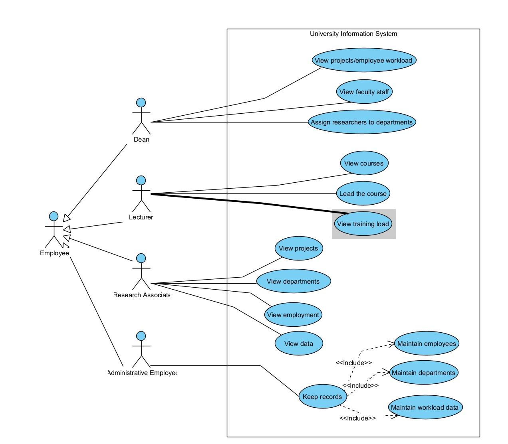
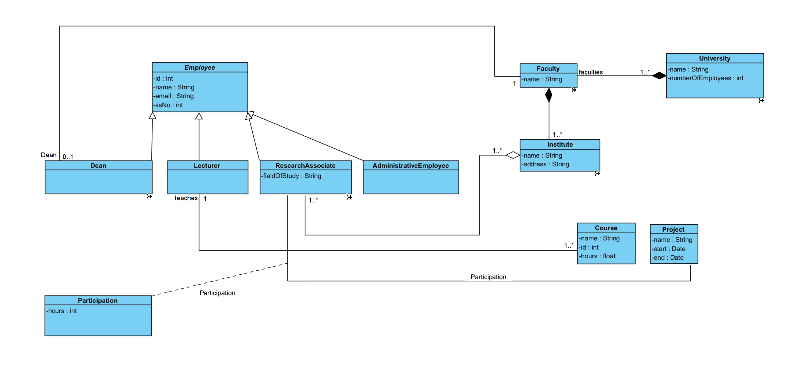
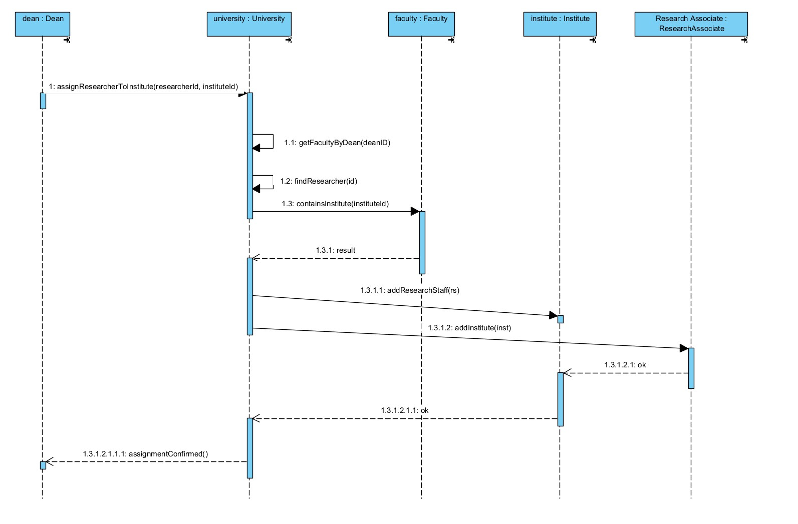
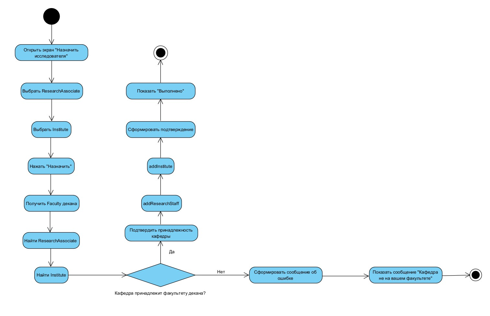
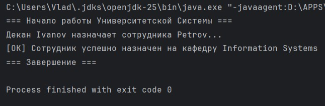
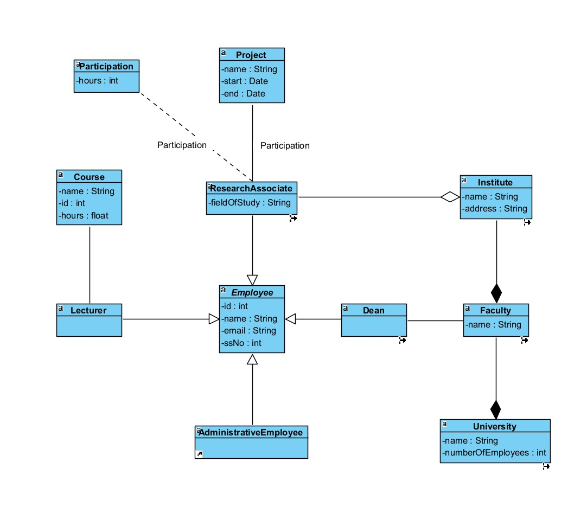

# Университетская информационная система
### Лабораторная работа №10 (UML моделирование и реинжиниринг)

## Описание проекта
Данная лабораторная работа представляет собой разработку UML-модели и программную реализацию информационной системы университета. 
Цель работы — построить полный цикл моделирования: от анализа требований (Use Case) до реализации в коде (Java) и обратного инжиниринга.

Система моделирует научно-педагогический состав университета, включая факультеты, кафедры, сотрудников (деканов, преподавателей, научных сотрудников) и их взаимодействие (назначение на должность, участие в проектах).

---

## 1. Use Case Diagram (Диаграмма прецедентов)
Диаграмма демонстрирует основные роли (акторов) и их возможности в системе.
Основные акторы:
- **Dean (Декан)**: Управляет персоналом, назначает сотрудников.
- **Research Associate (Научный сотрудник)**: Участвует в проектах, числится на кафедре.
- **Lecturer (Преподаватель)**: Ведет курсы.
- **Administrative Employee**: Ведет учет.

---

## 2. Class Diagram (Диаграмма классов)
Структура системы до написания кода. Показаны основные сущности, их атрибуты и связи (наследование, композиция, агрегация).
Ключевые моменты:
- **Employee** — абстрактный базовый класс.
- **University -> Faculty -> Institute** — иерархия через композицию.
- **ResearchAssociate <-> Project** — связь "многие ко многим" через класс **Participation**.

---

## 3. Sequence Diagram (Диаграмма последовательностей)
Сценарий: **"Назначение научного сотрудника на кафедру"**.
Показывает взаимодействие объектов во времени:
1. Декан инициирует назначение.
2. Система проверяет валидность (принадлежит ли кафедра факультету).
3. При успехе сотрудник добавляется в список кафедры.

---

## 4. Activity Diagram (Диаграмма активности)
Алгоритм процесса назначения сотрудника. Показаны действия, условия (ветвление "Да/Нет") и финальные состояния.

---

## 5. Реализация в коде (Java) и Выполнение
Система реализована на языке Java. 
В методе `Main` воспроизведен сценарий создания университета, факультета, сотрудников и успешного назначения сотрудника на кафедру.

**Скриншот выполнения программы (Console Output):**

---

## 6. Reverse Engineering (Обратный инжиниринг)
Диаграмма классов, автоматически сгенерированная средой Visual Paradigm на основе написанного Java-кода. 
Она подтверждает, что реализация полностью соответствует спроектированной модели.

*(Вставь путь к последней диаграмме, которую мы сделали реверсом)*

---

### Инструменты
- **Visual Paradigm** (UML моделирование, генерация кода, реверс-инжиниринг).
- **IntelliJ IDEA** (Написание и отладка кода).
- **Java** (Язык реализации).
